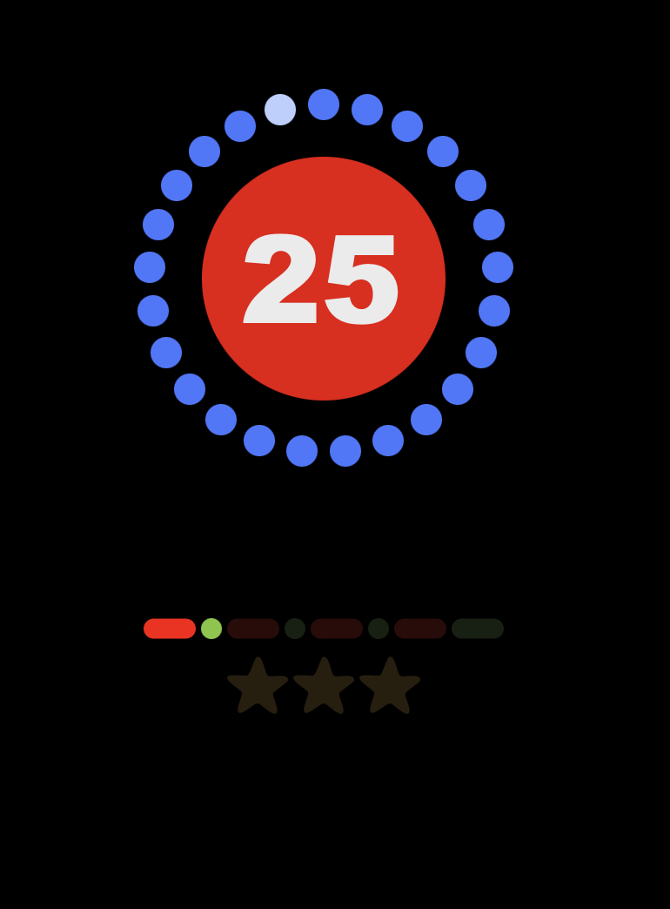

# Magic Timer

A Pomodoro-inspired productivity timer for a full workday.  
Designed and developed by Lars Munck, © 2024.

---

## Features

- **Circular minute countdown:** Visualizes each minute as a dot in a circle, with dynamic coloring and direction based on timer type.
- **Central timer button:** Displays remaining minutes and starts the timer.
- **Progress pills:** Track each completed timer cycle; pills (25/5/20 min) light up as you progress.
- **Stars row:** Track completed sets; stars light up after each full set of pills.
- **Chime sound:** Soft audio feedback when a timer finishes.
- **Responsive layout:** Works well on desktop and mobile.
- **Session logic:** Timer disables after all stars are completed, signaling the end of the workday (ca 7 hrs).

---

## Screenshots




---

## Installation

1. **Clone the repo:**

   ```bash
   git clone https://github.com/TrooperLooper/MagicTimer.git
   cd MagicTimer
   ```

2. **Install dependencies:**

   ```bash
   npm install
   ```

3. **Start the app:**
   ```bash
   npm run dev
   ```
   (Or use `npm start` if configured.)

---

## Usage

- Click the central button to start the timer.
- The minute dots count down, as you work or take a break.
- Complete cycles to light up pills and stars as you progress.
- When all stars are lit, your workday is complete!

---

## Tech Stack

- **React** (Vite)
- **JavaScript (ES6+)**
- **CSS**
- **SVG graphics**

---

## File Structure

- `/src/App.jsx` — Main app logic and state management
- `/src/components/MinutesCircle.jsx` — Circular minute dots
- `/src/components/BigButtonDot.jsx` — Central timer button
- `/src/components/PillRow.jsx` — Progress pills
- `/src/components/StarsRow.jsx` — Progress stars
- `/src/components/CountdownNumber.jsx` — Timer display

---

## Development Notes

- **Logic challenges:**
  - Dot direction and arc logic for different timer types
  - SVG sizing and z-index for visibility
  - State management for pills and stars
  - Responsive design and spacing tweaks
- **Solutions:**
  - Custom index calculations for dot direction
  - Inline SVG and viewBox fixes
  - Modular React components

---

## Ideas for Further Improvement

- Add unit tests (Jest/React Testing Library)
- Add accessibility features (ARIA labels, keyboard navigation)
- Add settings for custom timer lengths
- Add deployment instructions (Netlify, Vercel, GitHub Pages)
- Add a changelog and contribution guide
- Create this as a mobile-app in React Native

---

## Credits

- **Design & Development:** Lars Munck
- **SVG & UI assets:** Custom
- **Soundclip: Universfield @ pixabay**

---

## License

All rights reserved © 2025 Lars Munck

---
